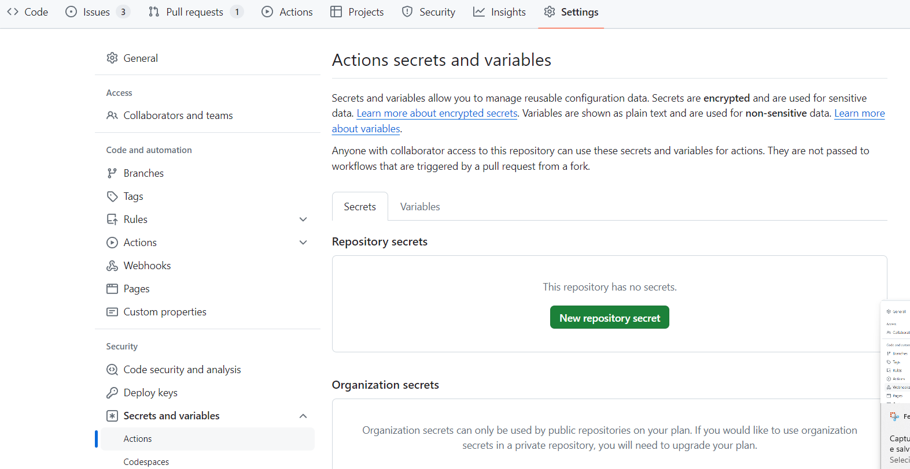
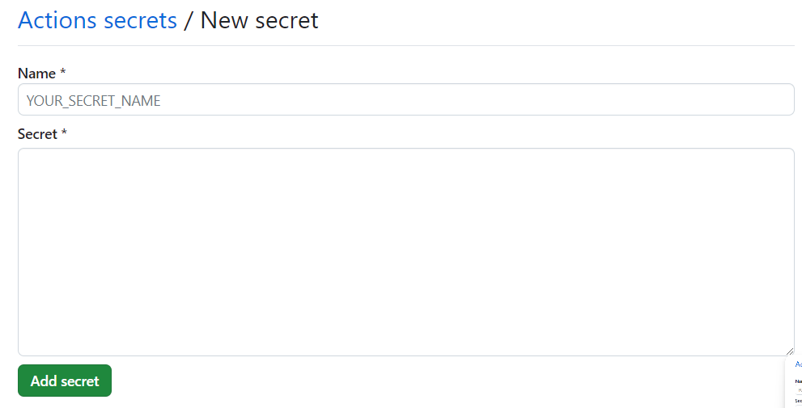

# Autenticação no Sharepoint 365 para extração de dados

Alguns projetos como o [obz-dados](https://github.com/splor-mg/obz-dados) e [dados-pptx-cofin](https://github.com/splor-mg/dados-pptx-cofin) precisam de realizar download de arquivos armazenados no sharepoint SPLOR  durante a execução da etapa de extração. 

Para tal, utilizamos o pacote [microsoft365R](https://cran.r-project.org/web/packages/Microsoft365R/index.html) nos scripts que realizam a extração. Esse pacote obtém acesso ao sharepoint corporativo por meio de  autenticação via browser com uma conta de usuário que possua as permissões necessárias. O pacote obtém dessa forma um token de autenticação e o armazena localmente na máquina do usuário.

Outros projetos podem possuir uma rotina de execução agendada da etapa de extração de dados via Github Actions, e tal forma de autenticação via browser não funciona nesse contexto. Todavia, como um token de autenticação é obtido e armazenado pelo Microsoft365R , esse mesmo token  pode ser encriptado e inserido no scripts do Github actions para que esse consiga autenticação.

Esse processo consiste em:

1. Obter o arquivo contendo o token  por meio do pacote Microsoft365R (somente necessário caso já não exista o token no repositório do projeto);
2. Gerar uma chave privada e e anotá-la;
3. Encriptar o token com essa chave privada e salvá-lo no diretório do projeto (e.g. `ms365.rds`);
4. Adicionar a chave privada nas configurações de [secret](https://docs.github.com/en/actions/security-guides/using-secrets-in-github-actionsdo) do Github actions (e.g. `MS365_key`);
5. Recuperar a chave privada por meio das opções de secrets do Gitub Actions e utilizá-la para descriptografar o token
6. Utilizar o token nos scripts do projeto para autenticar no sharepoint e obter acesso aos recursos, como arquivos e pastas.

Com esse par de informação, chave privada e token, o script de extração consegue fazer autenticação e download dos arquivos.

## Criação do token ms365.rds

Caso você não possua um token válido localmente, siga os passos descritos [aqui](https://github.com/splor-mg/cookiecutter-datapackage/issues/13) para obter um token novo.  O pacote Microsoft365R por padrão `C:\Users\<user>\AppData\Local\AzureR\`  no Windows e `"~/Library/Application Support/AzureR/` no Mac. O arquivo contendo o token tem um nome alfa-númerico como algo semelhante a  `0aaccf80a2c4a936420c1426459dgb3cc`.

!!! note

    Se você está criando um novo repositório anual a partir de um repositório upstream é provável que o token `ms365.rds` já esteja criado e armazenado (criptografado) no repositório. 


Na pasta do projeto execute no console do R:

```R
library(cyphr)

# gerar chave aleatória
k <- sodium::keygen()

# encriptar token utilizando a chave aletarória
key <- cyphr::key_sodium(k)
cyphr::encrypt_file("C:/Users/<user>/AppData/Local/AzureR/aaccf80a2c4a938420c1426459dfb3cc", key, "ms365r.rds") # <user> sendo o nome de usuário no Windows.
k_str <- sodium::bin2hex(k) # anote/guarde essa string
```

As funções [`sodium::keygen()`](https://cran.r-project.org/web/packages/sodium/vignettes/intro.html) e `cyphr::key_sodium(k)` são usadas para gerar uma chave aleatória que pode ser usada como chave de criptografia. A chave é gerada como um arquivo binário, portanto para que possa ser inserida como secret no Github actions é necessário transformá-la para a string equivalente por meio da função `sodium::bin2hex(k)`.  

Essa string precisa estar disponível como uma variável de ambiente `MS365_KEY` no seu ambiente de desenvolvimento local para descriptografar o token e no Github Actions para que o token armazenado no arquivo `ms365.rds` possa ser descriptografado.

Como o token fica exposto no Github ele deve ser criptografado com a chave gerada e será descriptografado posteriormente para autenticação no sharepoint durante a execução do Actions. Dessa forma o processo pode ocorrer no Github actions sem expor o token de autenticação publicamente.


## Recuperação do Token criptografado

Após o token ser disponibilizado como um arquivo .rds criptografado, para utilizá-lo execute o seguinte script R:

```R
# decriptar token criptografado
k_env <- Sys.getenv("MS365_KEY") # obtém a string da chave privada que foi armazenada como variável de ambiente
key <- cyphr::key_sodium(sodium::hex2bin(k_env)) # converte a chave privada de string para binário
token = cyphr::decrypt(readRDS("ms365r.rds"), key) # le e descriptografa o arquivo do token

```

Dessa forma o token pode ser utilizado para autenticação e obter os arquivos 


## Disponibilização da chave privada MS36_KEY para o Github Actions

No nosso plano atual do Github para a organização `splor-mg` "organization secrets and variables cannot be used by private repositories".
Portanto é necessário criar o segredo `MS365_KEY` em cada repositório que precisa de realizar extração.

Nas configurações do repositório (Settings), selecione "Secrets and Variables" e "actions":



Insira um novo segredo `MS36_KEY`  e a string da chave privada anotada:



Nota: Se você gerar outra chave privada e criptografar o arquivo com essa nova chave, naturalmente a chave anterior não funcionará para descriptografar o arquivo do token.

Importante lembrar que a variável de ambiente `MS365_KEY` deve estar disponível dentro do container, no `Makefile` do projeto:


```makefile
env:
	MS3655_KEY: ${{ secrets.MS365_KEY }}
run: 
	docker run -e MS365_KEY=$MS365_KEY --rm --mount type=bind,source=${PWD},target=/project fjuniorr/${{ github.event.repository.name }}
```


## Utilização do Token para acesso ao Sharepoint

Após todo o processo descrito até aqui, o token pode ser utilizado para autenticação e acesso a recursos no sharepoint, como no script R exemplo a seguir:

```R
library(Microsoft365R)
library(cyphr)

k_env <- Sys.getenv("MS365_KEY") # Chave privada obtido via secret vindo do Gitgub Actions

# decriptar token
key <- cyphr::key_sodium(sodium::hex2bin(k_str))
token <- cyphr::decrypt(readRDS("ms365r.rds"), key)

# utilizar token descriptado
site <- get_sharepoint_site(site_url = "https://cecad365.sharepoint.com/sites/Splor/", token = token)
print(site$get_drive()$list_items())

```

